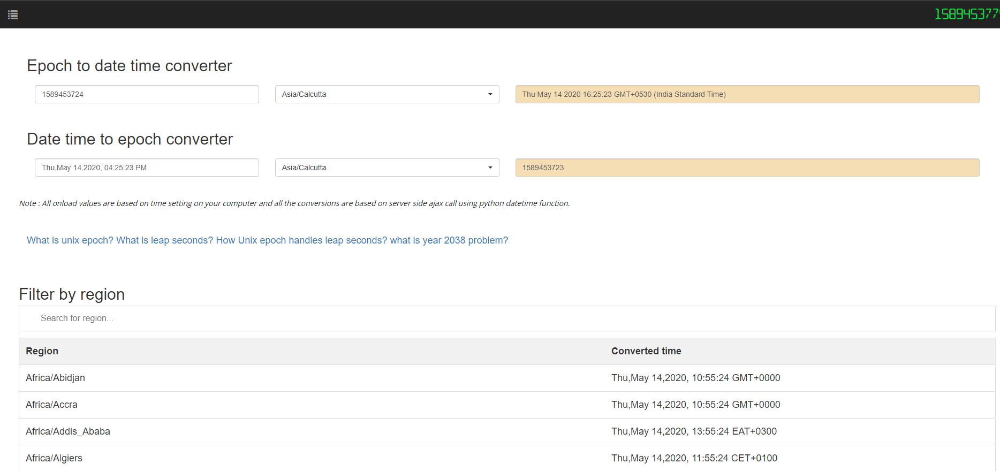

# Epoch converter


## Installation
```
#git clone https://github.com/vignesh88/epoch.git
#cd epoch/
#python manage.py runserver 0.0.0.0:8002
```
> Open your browser and view the application at http://localhost:8002
